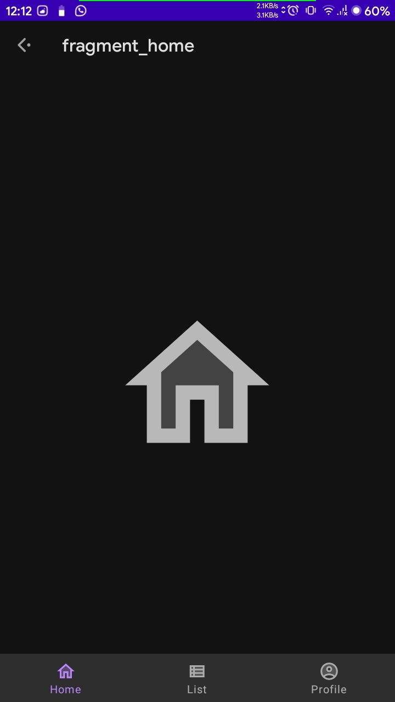
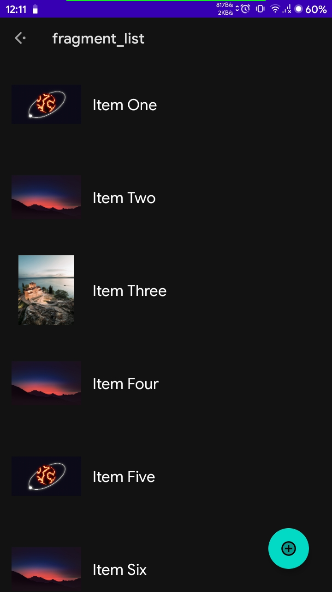
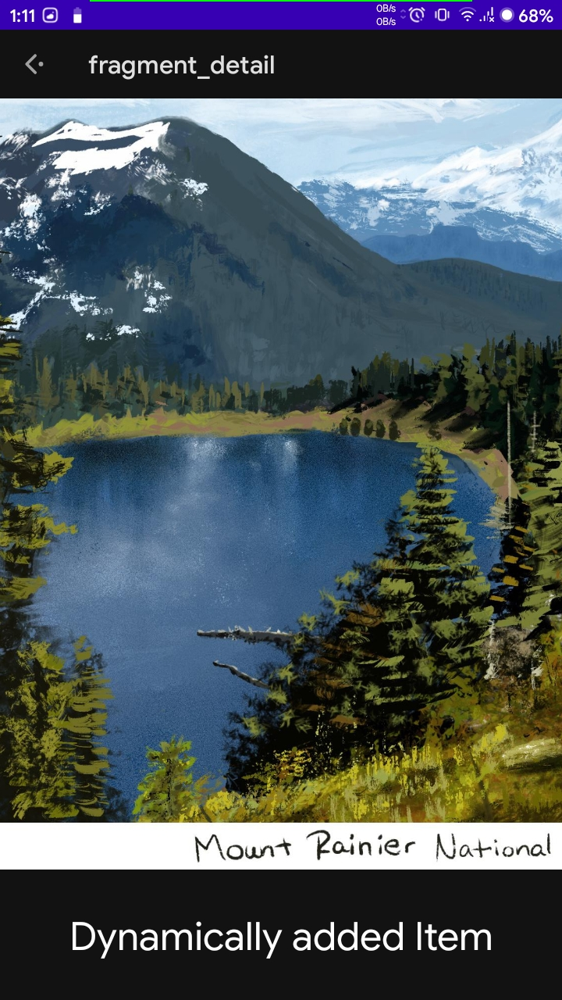
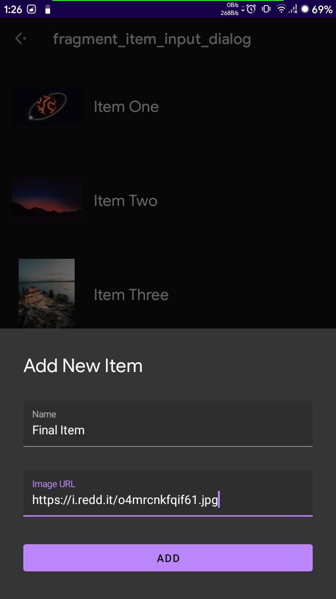
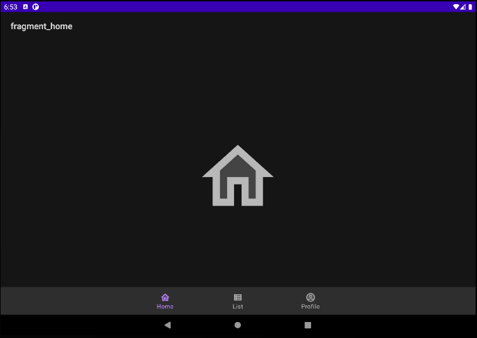
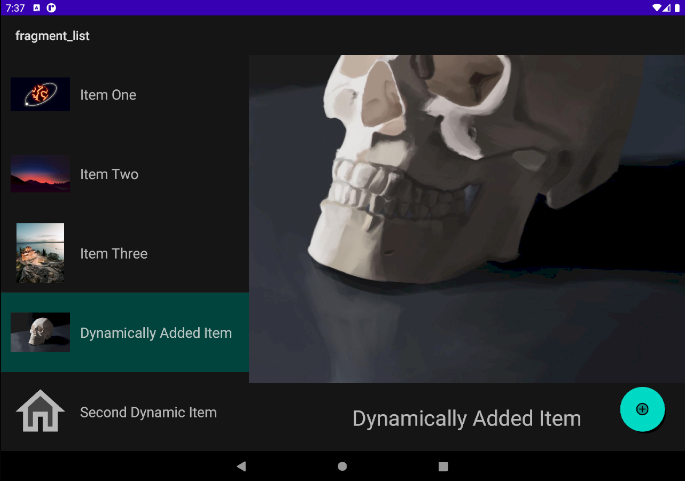
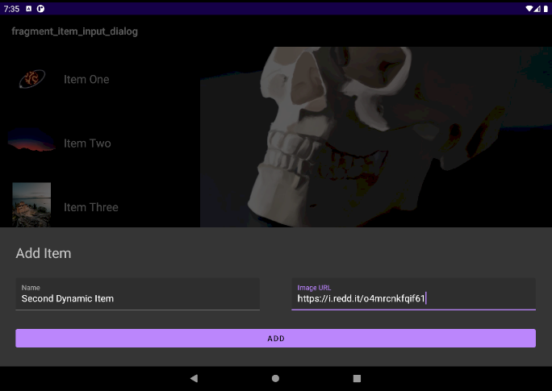

# Master Detail Pattern with Jetpack Navigation Component
This is an implementation of Master Detail UI pattern where phones utilize a regular layout but use the extra space available for other views if the space permits.

## Consists of the Following Architectural Patterns and Concepts:
- Single Activity Pattern
- Data Binding and Binding Adapters
- ViewModel Architecture
- Different Layouts for Portrait and Landscape
- Different Layouts for Phones and Tablets
- Jetpack Navigation Component
- Fragment within a Fragment
- Inter-Fragment Communication via ViewModel (Passing Data Between Fragments)
- Dialog and Regular Fragments via Navigation Graphs
- Bottom Navigation Bar
- Bottom Sheet Fragment (Modal Bottom Sheets)
- Multiple Navigation Graphs

## Phone Screenshots

 

## Tab/Large Screen Screenshots

